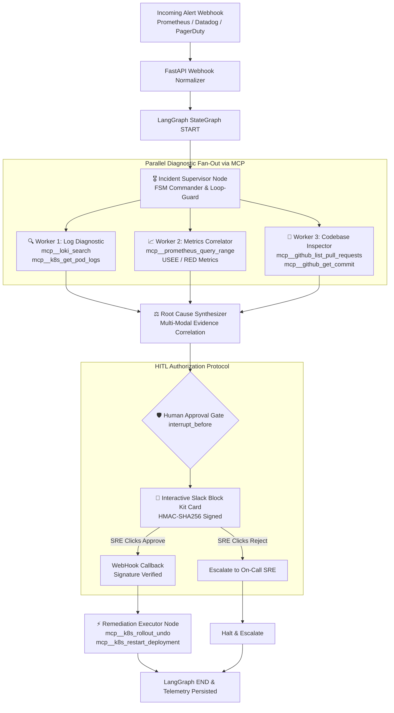

# 🏛️ IncidentOps AI: Architecture & System Design

**IncidentOps AI** is an enterprise-grade autonomous incident triage engine built using **LangGraph StateGraph**, **Claude 3.5 Sonnet (`claude-3-5-sonnet-20241022`)**, and the **Model Context Protocol (MCP)**.

---

## 1. High-Level Multi-Agent Architecture

---

## 2. Core Architectural Pillars

### A. Deterministic FSM Commander & Loop-Bound Guards
Unlike naive ReAct agents that get trapped in recursive exploratory tool loops, IncidentOps AI enforces:
1. **Loop Bound Guard (`iteration_count <= 3`)**: If a service's root cause cannot be isolated within 3 state iterations, the engine forces a transition directly to `root_cause_synthesis` with available telemetry to prevent token burning.
2. **Deterministic Task Routing**: The supervisor produces a typed `SupervisorPlan` adhering strictly to Pydantic schemas, dispatching specialized tasks with explicit priority levels.

### B. Parallel Diagnostic Fan-Out & Fan-In
When an alert fires:
- **Concurrency**: Log streams (Loki/Elasticsearch) and time-series metrics (Prometheus) are queried concurrently. If a release happened within $T_{incident} - 2h$, the Codebase Inspector queries GitHub diffs in parallel.
- **Synchronization (Fan-In)**: The StateGraph synchronizes completion across all three workers before triggering the Root Cause Synthesizer node.

### C. Model Context Protocol (MCP) Tool Abstraction
All observability interactions utilize the standard Model Context Protocol:
- `mcp__loki_search(query, start_time, end_time, limit)`
- `mcp__k8s_get_pod_logs(namespace, pod_name, container, tail_lines, previous)`
- `mcp__prometheus_query_range(query, start, end, step)`
- `mcp__github_list_pull_requests(repo, state, since)`
- `mcp__github_get_commit(repo, commit_sha)`

### D. Human-in-the-Loop (HITL) Cryptographic Gate
Remediation actions are **never executed autonomously without explicit authorization**:
1. The LangGraph compilation sets `interrupt_before=["approval_gate"]`.
2. A high-density interactive Slack Block Kit Card is posted with:
   - RCA summary & confidence percentage
   - Causal chain of events
   - Exact idempotent CLI remediation command (e.g. `kubectl rollout undo`)
   - Blast radius and MTTR calculation
3. SRE button clicks generate HMAC-SHA256 signatures (`v0=timestamp:body`), validated against replay attack windows before the checkpointer resumes execution.

### E. PostgreSQL Checkpoint Persistence
State machine executions are stored in PostgreSQL (`PostgresSaver`), enabling:
- Crash-resilient resumption across cluster restarts
- Threaded incident audits
- Complete historical telemetry playback
